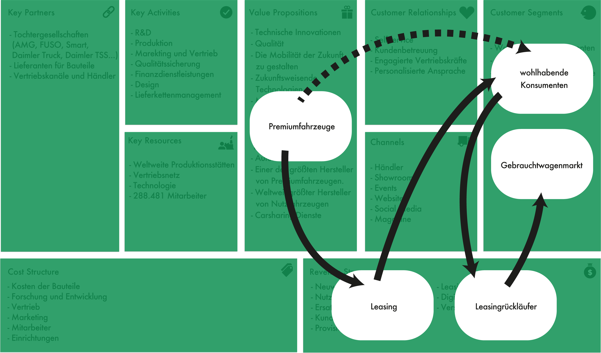

# Plan

### Identifizierung von Usecases

**Ermittlung des Restwertes von Leasingrückläufer**

Die Daimler AG spricht mit ihren Premiumfahrzeugen vor allem wohlhabende Konsumenten an. Dazu zählen Firmen, Selbstständige und auch Privatfahrer. Um den Kunden mehr Freiheiten zu geben und bei der Wahl des Fahrzeuges flexibler zu sein, bietet Daimler ihren Kunden unterschiedliche Leasingprodukte an.

Nach Ablauf des Leasingvertrages kehrt das Leasingfahrzeug zum Unternehmen zurück oder es besteht die Möglichkeit für den Kunden am Ende der Vertragslaufzeit das Fahrzeug zu einem bestimmten Preis zu kaufen. In den meisten Fällen ist jedoch ersteres der Fall.

So gibt es für die Daimler AG viele Leasingrückläufer, die wieder am Markt angeboten werden können. Da das Fahrzeug bereits benutzt wurde, sinkt auch dementsprechend der Wert. An dieser Stelle ist es notwendig ein Gutachten zu erstellen, dass den Restwert des Fahrzeuges ermittelt, um das Fahrzeug mit einem angepassten Preis wieder auf dem Markt anbieten zu können. Nach der Ermittlung des Restwertes landet das Fahrzeug entweder auf dem Gebrauchtwagenmarkt oder es wird unter der Kategorie „Gebrauchtwagen-Leasing“ angeboten.

### Erste Problemdefinition

Ich erforsche die Ermittlung des Restwertes von Leasingrückläufern, weil ich herausfinden möchten, ob ein Model in der Lage ist einen präzisen Restwert des Fahrzeuges zu ermitteln. Darauf basierend möchte ich die Pricing-Experten im Mercedes Benz Handel mit meinem Model unterstützen, um die Komplexität der Restwertermittlung zu verringern und eine schnellere und präzise Preisfindung zu ermöglichen.

### Identifizierung von potenziellen relevanten Variablen

In diesem Usecase ist es das zentrale Ziel, ein präzises Model zu erstellen, dass den Restwert des Fahrzeugs ermittelt. Damit das Model akkurate Ergebnisse liefert, muss das Model mit einem qualitativ hochwertigen Datensatz trainiert werden. Der Datensatz muss hierfür pro Instanz als abhängige Variable den Preis des Gebrauchtwagens und als unabhängige Variablen die Eigenschaften des Gebrauchtwagens enthalten.

Um den Wert des Fahrzeugs zu bestimmen, ist es notwendig eine Vielzahl von Faktoren zu berücksichtigen. So sollte man Variablen wie die Herkunft, das Alter des Fahrzeugs, den Kilometerstand, die PS-Anzahl und die Antriebsarten berücksichtigen. Andere Variablen wie Hubraum, Beschleunigung, Anzahl der Türen, Farbe und Ausstattung beeinflussen ebenfalls den Preis des Fahrzeugs (vgl. Arai et al., 2018, S. 415).

In einem Gespräch mit einem Autohändler wurden neben den genannten Variablen weitere wichtige Variablen genannt. So hat die Anzahl der Fahrzeughalter, der Fahrzeugzustand, die Schadstoffklasse, die Fahrzeugkategorie und das Getriebe ebenfalls einen Einfluss auf den Preis.

In der folgenden Grafik sind die potenziellen relevanten Variablen zu sehen, die einen Einfluss auf die abhängige Variable „Preis“ haben.

### Definition der Metriken

**Heuristische Gedanken**

Um erste Metriken für diesen Usecase zu definieren, ist es hilfreich sich zunächst zu überlegen, wie man vorgehen würde, wenn man nicht auf das Model zurückgreifen könnte.

Wenn man kein Modell verwenden würde, so würde man vermutlich auf Erfahrungswerte setzen und eine Vielzahl von Fahrzeugdaten vergleichen, um den Restwert des Fahrzeugs zu ermitteln. Diese Vorgehensweise ist zu einem sehr aufwendig und zum anderen besteht die Gefahr, dass man durch zu niedrig angesetzte Preise die Gewinne geschmälert werden können. „So mussten die deutschen Automobilhersteller in den USA rund 1 Milliarde Euro Verlust beim Wiederverkauf von 2,2 Millionen Autos, deren Leasingverträge 2008 ausliefen, hinnehmen.“ (Deutsche Presse-Agentur GmbH, 2009).

**Model Problem Definition**

Wir wollen, dass das Modell den Restwert von Leasingrückläufern ermittelt.
Das ideale Ergebnis ist es, einen präzisen Restwert zu erhalten, sodass die Komplexität bei der Restwertermittlung reduzieren werden kann.
So könnte man die Kosten bei der Restwertermittlung senken und einen höheren Gewinn durch den präzisen wettbewerbsfähigen Preis erhalten.

**Definition der Erfolgsmetriken**

Erfolgsmetriken:
- Reduzierung der Zeit, die für die Preisermittlung benötigt wird
- Steigerung des Gewinns durch Leasingrückläufer

Key results (KR):
- Reduzierung der Zeit um 30%, die für die Preisermittlung benötigt wird
- 10% mehr Gewinn durch Leasingrückläufer

Misserfolg des Modells:
- Die Zeit, die für die Preisermittlung benötigt wird, konnte nur um 10% reduziert werden.
- Der Gewinn durch Leasingrückläufer konnte nur um 5% gesteigert werden.
